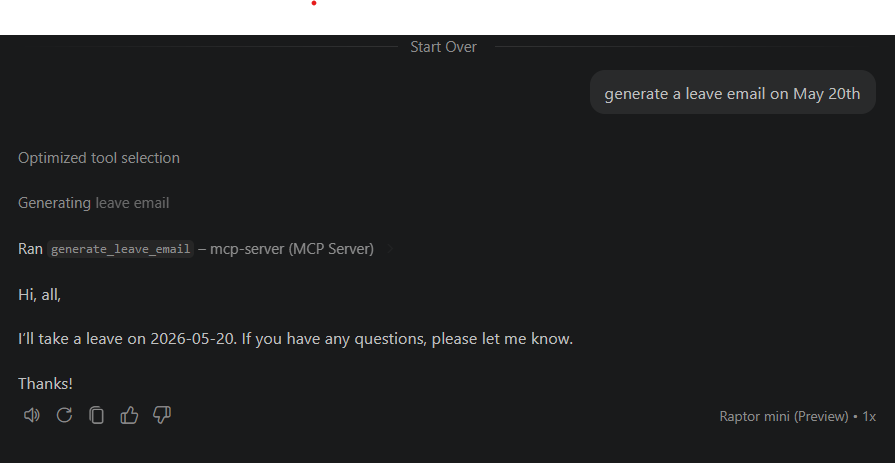

# MCP 项目

A minimal [FastMCP](https://github.com/jlowin/fastmcp) server demo with example tools.

## Requirements

- Python 3.13+
- [uv](https://docs.astral.sh/uv/)

## init evn

```bash
uv init .
```

## 安装 MCP SDK

[MCP SDK](https://github.com/modelcontextprotocol/python-sdk?utm_source=chatgpt.com#overview) 是一个 Python 库，提供了与 MCP 服务器进行通信的接口。它允许开发者轻松地构建与 MCP 服务器交互的应用程序。

```bash
uv add "mcp[cli]"
```

## 写MCP的具体实现

1: 使用注解@mcp.tool()修饰，然后完成一个function 函数，like
```code
@mcp.tool()
def generate_leave_email(date: str) -> str:
    """Generate a leave request email for the given date (YYYY-MM-DD)."""
    return (
        f"Hi, all, I'll take a leave on {date}. "
        "If you have any questions, please let me know. Thanks! Best regards, [Your Name]"
    )
```

2: mcp启动方法
```code

if __name__ == "__main__":
    mcp.run()

```


## 添加到VS code for windows

方式1： 在.vscode目录下创建mcp.json文件，并添加以下内容：

```code
{
    "servers": {
        "mcp-server": {
           "type": "stdio",
           "command": "C:\\Users\\tianjin\\.local\\bin\\uv.exe",
           "args": ["run", "python", "main.py"],
           "cwd": "D:\\AI\\mcp-server"
        }
    },
    "inputs": []
}
```

1: "mcp-server"： 是服务器的名称，可以自定义。

2: "type": "stdio"： 指定服务器的通信方式为标准输入输出。

3: "command": "C:\\Users\\tianjin\\.local\\bin\\uv.exe"： 指定要运行的命令，这里是uv.exe的路径。

4: "args": ["run", "python", "main.py"]： 指定运行命令的参数，这里是运行Python脚本main.py。

5: "cwd": "D:\\AI\\mcp-server"： 指定服务器的工作目录，这里是mcp-server的路径。

方式2：通过mcp servers插件，然后命令面板（Ctrl+Shift+P）选择 "MCP: Add Server"，然后按照提示输入服务器的名称、类型、命令、参数和工作目录。

## 添加到VS code for MAC

todo

## start server

在mcp.json中，点击start 按钮，然后就可以在copilot中使用mcp-server了。

## validation


